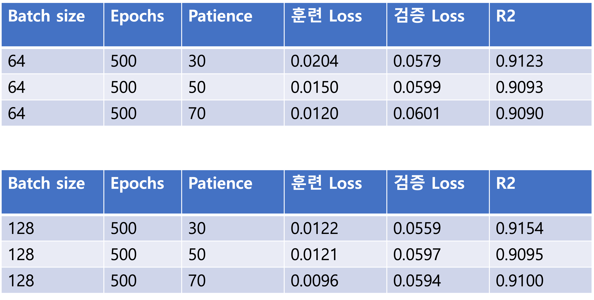
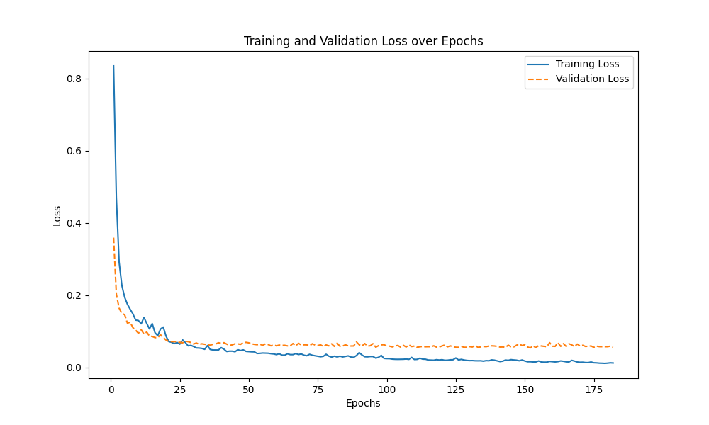
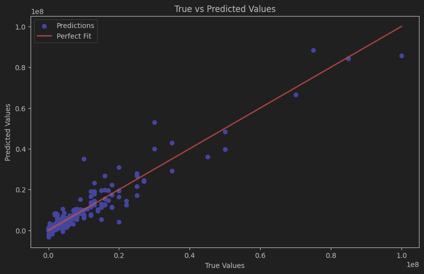

# 4-2_Machine-Learning-Project

## 1. 프로젝트 주제
* 축구선수 시장가치 예측 프로젝트

## 2. 주요 라이브러리
* Pytorch
* Pandas
* Numpy
* Sklearn
* Matplotlib
## 3. 데이터 출처
* 캐글 데이터 이용 [kaggle](https://www.kaggle.com/code/gustavodearajo/soccer-current-value-prediction)
### 3-1. 데이터 정보
``` python
# 데이터 로드
data = pd.read_csv("./data/final_data.csv")
# 데이터 정보
print(data.info())
```
```
<class 'pandas.core.frame.DataFrame'>
RangeIndex: 10754 entries, 0 to 10753
Data columns (total 22 columns):
 #   Column               Non-Null Count  Dtype  
---  ------               --------------  -----  
 0   player               10754 non-null  object 
 1   team                 10754 non-null  object 
 2   name                 10754 non-null  object 
 3   position             10754 non-null  object 
 4   height               10754 non-null  float64
 5   age                  10754 non-null  float64
 6   appearance           10754 non-null  int64  
 7   goals                10754 non-null  float64
 8   assists              10754 non-null  float64
 9   yellow cards         10754 non-null  float64
 10  second yellow cards  10754 non-null  float64
 11  red cards            10754 non-null  float64
 12  goals conceded       10754 non-null  float64
 13  clean sheets         10754 non-null  float64
 14  minutes played       10754 non-null  int64  
 15  days_injured         10754 non-null  int64  
 16  games_injured        10754 non-null  int64  
 17  award                10754 non-null  int64  
 18  highest_value        10754 non-null  int64  
 19  position_encoded     10754 non-null  int64  
 20  winger               10754 non-null  int64  
 21  current_value        10754 non-null  int64  
dtypes: float64(9), int64(9), object(4)
memory usage: 1.8+ MB
None
```
### 3-2. 데이터 샘플
``` python
print(data.tail())
```
```
                                          player                      team  \
10749       /aidan-simmons/profil/spieler/867763  Western Sydney Wanderers   
10750        /kusini-yengi/profil/spieler/708099  Western Sydney Wanderers   
10751    /nathanael-blair/profil/spieler/1023268  Western Sydney Wanderers   
10752    /zachary-sapsford/profil/spieler/703657  Western Sydney Wanderers   
10753  /alexander-badolato/profil/spieler/957230  Western Sydney Wanderers   

                     name               position      height   age  \
10749       Aidan Simmons     Attack-RightWinger  181.240353  20.0   
10750        Kusini Yengi  Attack Centre-Forward  190.000000  24.0   
10751     Nathanael Blair  Attack Centre-Forward  181.240353  19.0   
10752    Zachary Sapsford  Attack Centre-Forward  181.240353  20.0   
10753  Alexander Badolato  Attack Centre-Forward  170.000000  18.0   

       appearance     goals   assists  yellow cards  ...  goals conceded  \
10749          16  0.175953  0.087977      0.263930  ...             0.0   
10750          26  0.372671  0.186335      0.186335  ...             0.0   
10751          20  0.375000  0.000000      0.187500  ...             0.0   
10752          17  0.312139  0.104046      0.000000  ...             0.0   
10753          21  0.000000  0.000000      0.086042  ...             0.0   

       clean sheets  minutes played  days_injured  games_injured  award  \
10749           0.0            1023             0              0      0   
10750           0.0            1449           102             18      0   
10751           0.0             960             0              0      0   
10752           0.0             865             0              0      0   
10753           0.0            1046             0              0      0   

       highest_value  position_encoded  winger  current_value  
10749          75000                 4       1          75000  
10750         300000                 4       0         300000  
10751          50000                 4       0          50000  
10752          50000                 4       0          50000  
10753          25000                 4       0          25000  
```
## 4. 사용 머신러닝 모델 
* 선형회귀 
### 4-1. 선형회귀란?
* 데이터의 관계를 기반으로 예측을 수행하는 모델로, 주어진 데이터와 예측 데이터간의 오차를 최소화 할 수 있도록 하는 최적의 기울기를 찾아 예측하는 모델이다.

## 5. 학습
### 5-1. 모델 구조(model.py)
아래 코드는 2개의 은닉층을 가진 선형 모델을 정의한 코드로, 각 은닉층마다 ReLU 활성화 함수를 적용하여 음수 값을 0으로 처리합니다.
``` python
import torch.nn as nn

class LinearModel(nn.Module):
    def __init__(self, input_dim):
        super(LinearModel, self).__init__()
        self.hidden1 = nn.Linear(input_dim, 128)
        self.hidden2 = nn.Linear(128, 64)
        self.output = nn.Linear(64, 1)
        self.relu = nn.ReLU()

    def forward(self, x):
        x = self.relu(self.hidden1(x))
        x = self.relu(self.hidden2(x))
        return self.output(x)
```
### 5-2. 모델 학습(trainer.py)
아래 코드는 학습한 모델을 저장하는 코드로써 train 파일을 이용해 학습을 진행한다.
``` python
import pandas as pd
import torch.nn as nn
from sklearn.model_selection import train_test_split
from torch.optim import Adam
import utils as util
import linearModel
import train
import random
import numpy as np
import torch

# 시드 고정
seed = 42
random.seed(seed)
np.random.seed(seed)
torch.manual_seed(seed)

if torch.cuda.is_available():
    torch.cuda.manual_seed_all(seed)

torch.backends.cudnn.deterministic = True
torch.backends.cudnn.benchmark = False

# 데이터 로드
data = pd.read_csv("./data/final_data.csv")

x, y = util.preprocess_data(data)

# 데이터 로드 및 전처리
x_scaled, y_scaled, scaler_x, scaler_y = util.standardize_data(x, y)

# 학습 데이터 분리
x_train, x_test, y_train, y_test = train_test_split(x_scaled, y_scaled, test_size=0.2, random_state=42)

# 모델 정의
input_dim = x_train.shape[1]
model = linearModel.LinearModel(input_dim)

# 손실 함수 및 옵티마이저 정의
criterion = nn.MSELoss()
optimizer = Adam(model.parameters(), lr=0.001)

train_losses, val_losses, val_r2_scores = train.train_model(
    model, criterion, optimizer, x_train, y_train, x_test, y_test, 128, 500, 30
)

# 최종 결과 출력
print(f"마지막 훈련 Loss 값: {train_losses[-1]:.4f}")
print(f"마지막 검증 Loss 값: {val_losses[-1]:.4f}")
print(f"마지막 R² Score 값: {val_r2_scores[-1]:.4f}")

# 손실 시각화
util.plot_losses(train_losses, val_losses)

# 모델 저장
torch.save(model.state_dict(), "model/model.pth")
```
### 5-3. 모델 학습(train.py)
아래 코드는 trainer 코드에서 선정한 batch_size, epoch, patience를 기반으로 실제 학습을 진행하는 코드입니다.
EalryStopping 기법을 도입하여 성능이 유의미하게 향상되지 않을 때 학습을 조기에 종료합니다

> 하이퍼파라미터(batch_size, epoch, patience) 해당 수치로 한 이유는?
해당 수치를 낮출경우 모델의 성능이 낮아졌고, 높이면 유의미한 성능 향상이 보이지않아 해당 자료의 수치로 학습을 진행한 결과 128, 500, 30일 때가 가장 결정계수(R^2)의 결과가 좋게 나왔기 때문에 해당 수치로 고정했습니다.



``` python
import torch
from torch.utils.data import DataLoader, TensorDataset
from sklearn.metrics import r2_score

def train_model(model, criterion, optimizer, x_train, y_train, x_test, y_test, batch_size, epochs, patience):
    train_losses = []
    val_losses = []
    val_r2_scores = []  # R² 스코어 저장 리스트

    # Early stopping 설정
    best_val_loss = float('inf')
    patience_counter = 0

    # 데이터 로더 생성
    train_dataset = TensorDataset(torch.tensor(x_train, dtype=torch.float32), torch.tensor(y_train, dtype=torch.float32).view(-1, 1))
    train_loader = DataLoader(train_dataset, batch_size=batch_size, shuffle=True)

    print(train_dataset)
    print(train_loader)

    for epoch in range(epochs):
        model.train()  # 학습 모드 활성화
        epoch_loss = 0

        for batch_X, batch_y in train_loader:
            y_pred = model(batch_X)
            loss = criterion(y_pred, batch_y)
            optimizer.zero_grad()
            loss.backward()
            optimizer.step()
            epoch_loss += loss.item()

        train_losses.append(epoch_loss / len(train_loader))

        # 검증 손실 및 R² 스코어 계산
        model.eval()
        with torch.no_grad():
            y_pred_val = model(torch.tensor(x_test, dtype=torch.float32))
            val_loss = criterion(y_pred_val, torch.tensor(y_test, dtype=torch.float32).view(-1, 1))
            val_losses.append(val_loss.item())

            # R² 스코어 계산
            r2 = r2_score(y_test, y_pred_val.numpy())
            val_r2_scores.append(r2)

        # Early stopping 체크
        if val_loss < best_val_loss:
            best_val_loss = val_loss
            patience_counter = 0
        else:
            patience_counter += 1

        if patience_counter >= patience:
            print(f"학습 조기 종료 {epoch + 1}")
            break

        # Epoch 결과 출력
        if (epoch + 1) % 10 == 0:
            print(f"Epoch [{epoch + 1}/{epochs}], "
                  f"훈련 Loss: {train_losses[-1]:.4f}, 검증 Loss: {val_losses[-1]:.4f}, "
                  f"검증 R²: {val_r2_scores[-1]:.4f}")

    return train_losses, val_losses, val_r2_scores

```

### 5-4. 학습 결과
```
Epoch [10/500], 훈련 Loss: 0.1297, 검증 Loss: 0.0943, 검증 R²: 0.8571
Epoch [20/500], 훈련 Loss: 0.0864, 검증 Loss: 0.0757, 검증 R²: 0.8853
Epoch [30/500], 훈련 Loss: 0.0579, 검증 Loss: 0.0648, 검증 R²: 0.9019
Epoch [40/500], 훈련 Loss: 0.0547, 검증 Loss: 0.0666, 검증 R²: 0.8992
Epoch [50/500], 훈련 Loss: 0.0437, 검증 Loss: 0.0680, 검증 R²: 0.8970
Epoch [60/500], 훈련 Loss: 0.0355, 검증 Loss: 0.0597, 검증 R²: 0.9096
Epoch [70/500], 훈련 Loss: 0.0338, 검증 Loss: 0.0626, 검증 R²: 0.9052
Epoch [80/500], 훈련 Loss: 0.0285, 검증 Loss: 0.0653, 검증 R²: 0.9012
Epoch [90/500], 훈련 Loss: 0.0409, 검증 Loss: 0.0626, 검증 R²: 0.9052
Epoch [100/500], 훈련 Loss: 0.0244, 검증 Loss: 0.0589, 검증 R²: 0.9108
Epoch [110/500], 훈련 Loss: 0.0219, 검증 Loss: 0.0591, 검증 R²: 0.9105
Epoch [120/500], 훈련 Loss: 0.0214, 검증 Loss: 0.0594, 검증 R²: 0.9100
Epoch [130/500], 훈련 Loss: 0.0188, 검증 Loss: 0.0576, 검증 R²: 0.9128
Epoch [140/500], 훈련 Loss: 0.0180, 검증 Loss: 0.0581, 검증 R²: 0.9120
Epoch [150/500], 훈련 Loss: 0.0178, 검증 Loss: 0.0627, 검증 R²: 0.9050
Epoch [160/500], 훈련 Loss: 0.0160, 검증 Loss: 0.0587, 검증 R²: 0.9111
Epoch [170/500], 훈련 Loss: 0.0142, 검증 Loss: 0.0595, 검증 R²: 0.9099
Epoch [180/500], 훈련 Loss: 0.0118, 검증 Loss: 0.0574, 검증 R²: 0.9131
학습 조기 종료 182
마지막 훈련 Loss 값: 0.0122
마지막 검증 Loss 값: 0.0559
마지막 R² Score 값: 0.9154
```


## 6. 실험(predict.ipynb)
해당 실험은 원-핫 인코딩 되어있는 특성을 이용해 4(공격수)에 해당하는 선수들의 가치를 예측합니다.
### 6-1. 전처리
``` python
print(f"이전 데이터 data 개수: {data.shape}")

x, y = util.preprocess_data(data)

print(f"전처리 후 x data 개수: {x.shape}")
print(f"전처리 후 y data 개수: {y.shape}")
```
```
이전 데이터 data 개수: (10754, 22)
전처리 후 x data 개수: (2902, 14)
전처리 후 y data 개수: (2902,)
```

### 6-2. 데이터 분리 및 변환
``` python
# 학습/테스트 데이터 분리
x_train, x_test, y_train, y_test = train_test_split(x_scaled, y_scaled, test_size=0.2, random_state=42)

print(x_train.shape)
print(y_train.shape)
print(x_test.shape)
print(y_test.shape)

# 8. 데이터를 PyTorch 텐서로 변환
x_train_tensor = torch.tensor(x_train, dtype=torch.float32)
y_train_tensor = torch.tensor(y_train, dtype=torch.float32).view(-1, 1)
x_test_tensor = torch.tensor(x_test, dtype=torch.float32)
y_test_tensor = torch.tensor(y_test, dtype=torch.float32).view(-1, 1)
```
```
(2321, 14)
(2321, 1)
(581, 14)
(581, 1)
```

### 6-3. 모델 load
``` python
# 모델 불러오기
input_dim = x_train_tensor.shape[1]
model = linearModel.LinearModel(input_dim=input_dim)
model.load_state_dict(torch.load("./model/model.pth", weights_only=True))
model.eval()
```
```
LinearModel(
  (hidden1): Linear(in_features=14, out_features=128, bias=True)
  (hidden2): Linear(in_features=128, out_features=64, bias=True)
  (output): Linear(in_features=64, out_features=1, bias=True)
  (relu): ReLU()
)
```
### 6-4 자동 미분 비활성화 및 예측
```
# 예측 값을 실제 값으로 변환
y_pred_test_original = scaler_y.inverse_transform(y_pred_test)
y_test_original = scaler_y.inverse_transform(y_test_tensor)

mse = mean_squared_error(y_test_original, y_pred_test_original)
r2 = r2_score(y_test_original, y_pred_test_original)
rmse = np.sqrt(mse)

print(f"Test MSE: {mse:.4f}")
print(f"RMSE: {rmse:.4f}")
print(f"Test R²: {r2:.4f}")

# 결과 시각화
util.plot_prediction_result(y_test_original, y_pred_test_original)
```
```
Test MSE: 6996715620210.2520
RMSE: 2645130.5488
Test R²: 0.9154
```


## 7. 결론
* MSE의 수치를 보았을 때 오차가 제곱되어 누적되기 때문에 모델 성능이 나쁘다고 판단될 수 있으나, 결정계수가 **0.9**로 높게 나타났고, RMSE가 **260**만이라는 점을 고려했을 때 데이터 셋 상에서 가치가 0부터 1억 5천 사이의 데이터인 것을 감안했을 떄 예측 성능이 우수하다고 판단됩니다.

## 8. 소감
* 프로젝트 계획서를 제출할 당시에, 처음 진행하는 머신러닝 프로젝트였기 때문에 결과가 우수하게 나올지 걱정이 많았습니다 그러나 프로젝트를 진행하면서 강의 시간에 배운 내용이 하나씩 떠오르기 시작했고, 예상과 달리 좋은 성능으로 프로젝트를 마칠 수 있었습니다. 만약 이 프로젝트를 개선한다면, 다양한 하이퍼파라미터 튜닝 및 전처리 과정을 고도화하여 모델의 성능을 향상시키고 싶습니다.